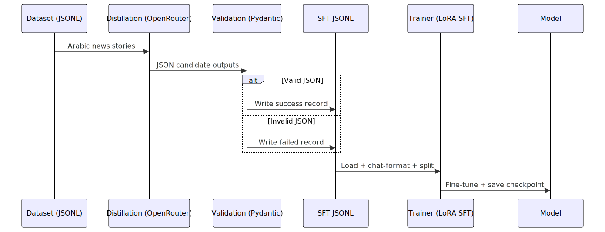

# 🌟 Arabic News Assistant - Qwen Finetuning Project

[](https://www.python.org/downloads/)
[](https://opensource.org/licenses/MIT)
[](https://github.com/psf/black)

A complete end-to-end pipeline for finetuning Qwen models on Arabic news data for instruction-following tasks like structured information extraction and translation.

> Note: Any “metrics/benchmarks” sections in this README are **placeholders** until you replace them with results from your own training runs.

## 🧾 CV / Resume Description

Built an end-to-end LLM fine-tuning pipeline for Arabic news understanding:

- Distilled instruction data from a larger model (DeepSeek via OpenRouter) into structured JSON targets
- Validated generated outputs with Pydantic schemas and exported an SFT-ready JSONL dataset
- Fine-tuned Qwen2.5 with LoRA + 4-bit quantization (Unsloth/TRl-style SFT) and tracked experiments with W&B
- Shipped notebooks + scripts for dataset generation, training, and inference

---

## 📋 Table of Contents

- [Features](#-features)
- [Project Structure](#-project-structure)
- [System Architecture](#-system-architecture)
- [Data Flow](#-data-flow)
- [Model Architecture](#-model-architecture)
- [Quick Start](#-quick-start)
- [Installation](#-installation)
- [Usage](#-usage)
- [Pipeline Overview](#-pipeline-overview)
- [Model Performance](#-model-performance)
- [Training Metrics](#-training-metrics)
- [API Reference](#-api-reference)
- [Contributing](#-contributing)
- [License](#-license)

---

## ✨ Features

- **🔥 Optimized Training**: Uses Unsloth for faster training and lower memory usage
- **📊 Data Generation**: Knowledge distillation from DeepSeek API via OpenRouter
- **🎯 Multi-Task Learning**: Extraction, translation, and NER in one model
- **💾 Memory Efficient**: LoRA finetuning with 4-bit quantization
- **📈 Experiment Tracking**: Integration with Weights & Biases
- **🚀 Easy Deployment**: Ready-to-use inference API
- **🌍 Multilingual**: Supports Arabic, English, and French

---

## 📁 Project Structure

```
arabic-news-assistant/
├── 📂 datasets/                  # ✅ Versioned sample datasets (committed)
│   ├── news-sample.jsonl         # Raw-ish sample news records (JSONL)
│   ├── sft.jsonl                 # Example SFT file (optional)
│   └── xsft.jsonl                # Tiny SFT file for quick smoke tests
│
├── 📂 data/                      # 🚫 Generated/local artifacts (gitignored)
│   ├── raw/                      # Your private raw data (optional)
│   └── processed/                # Generated SFT outputs
│
├── 📂 src/                       # Source code
│   ├── data_generator.py         # Knowledge distillation pipeline
│   ├── data_loader.py            # Dataset loading utilities
│   ├── models.py                 # Pydantic schemas
│   ├── trainer.py                # Training orchestration
│   └── inference.py              # Model inference API
│
├── 📂 config/                    # Configuration files
│   └── training_config.yaml      # Training hyperparameters
│
├── 📂 notebooks/                 # Jupyter notebooks
│   ├── main_pipeline.ipynb       # Complete pipeline demo
│   ├── unslouth_local.ipynb      # Local training notebook
│   └── unslouth.ipynb            # Colab training notebook
│
├── 📂 outputs/                   # Training outputs
│   ├── models/                   # Saved model checkpoints
│   └── logs/                     # Training logs
│
├── 📜 requirements.txt           # Python dependencies
├── 📜 .env.example              # Environment variables template
├── 📜 RUN_GUIDE.md              # Detailed step-by-step guide
└── 📜 README.md                 # This file
```

---

## ⚡ Quick Start

> Recommended: Python **3.11** (Windows-friendly). Some ML dependencies may not have wheels for Python 3.13 yet.

1) Install dependencies

```bash
pip install -r requirements.txt
```

2) Create `.env`

```bash
cp .env.example .env
```

Fill in `OPENROUTER_API_KEY` (and optionally `HUGGINGFACE_TOKEN`, `WANDB_API_KEY`).

3) Generate SFT data (uses the included sample file)

```python
import os
from dotenv import load_dotenv

from src.data_loader import DataLoader
from src.data_generator import DataGenerator

load_dotenv()

raw = DataLoader.load_raw_data("datasets/news-sample.jsonl")

generator = DataGenerator(
  api_key=os.getenv("OPENROUTER_API_KEY"),
  model_id="deepseek/deepseek-v3.1-terminus",
  temperature=0.2,
  max_tokens=512,
)

generator.generate_sft_dataset(
  raw_data=raw[:10],
  output_path="data/processed/sft.jsonl",
  include_translations=True,
  target_languages=["English", "French"],
  max_samples=10,
)
```

4) Train (see `RUN_GUIDE.md` for the full notebook/script options)

---

---

## 🏗️ System Architecture



Diagram source: `docs/diagrams/system-architecture.mmd`

---

## 🔄 Data Flow Pipeline



Diagram source: `docs/diagrams/data-flow.mmd`

---

## 🧠 Model Architecture

| Component | Choice |
|----------|--------|
| Base model | Qwen2.5 Instruct (`config/training_config.yaml`) |
| Fine-tuning | LoRA (PEFT), optionally 4-bit quantized |
| Objective | Chat-style SFT (`messages[]`) |
| Output formats | JSON for extraction, text for translations |

---

## 📊 Training Pipeline


Diagram source: `docs/diagrams/training-pipeline.mmd`

---

## 📈 Performance Metrics

> Placeholder section: replace with your own evaluation results.

| Task | Suggested metric | Your result |
|------|------------------|------------|
| Extraction (JSON schema) | JSON validity rate, manual accuracy sample | _TBD_ |
| Translation | BLEU / COMET / human eval | _TBD_ |
| NER | Precision / Recall / F1 | _TBD_ |
| Classification | Accuracy / Macro-F1 | _TBD_ |

### Training Statistics

| Metric | Value | Notes |
|--------|-------|-------|
| **Training loss** | _TBD_ | Final epoch |
| **Validation loss** | _TBD_ | Best checkpoint |
| **Training time** | _TBD_ | Hardware-dependent |
| **Peak GPU memory** | _TBD_ | GPU-dependent |
| **Tokens/sec** | _TBD_ | Depends on setup |
| **Total steps** | _TBD_ | Epochs × steps |
| **Learning rate** | _TBD_ | From config |
| **Effective batch size** | _TBD_ | Batch × grad accum |
| **Model size** | _TBD_ | Base model |
| **LoRA params** | _TBD_ | Depends on LoRA config |
| **Dataset size** | _TBD_ | Successful examples |

---

## 📊 Model Performance

> Placeholder section: replace with your own training curves (W&B screenshots or exported plots).

### Suggested Plots to Include

| Plot | Where to get it |
|------|------------------|
| Train vs eval loss | W&B run dashboard or Trainer logs |
| Learning rate schedule | Trainer logs |
| GPU memory / utilization | `nvidia-smi` + W&B system metrics |
| Samples/sec / tokens/sec | Trainer logs |

---

## 📈 Training Metrics

> Placeholder section: replace with your own logs/plots.

### Detailed Epoch Breakdown

| Epoch | Steps | Train loss (start→end) | Eval loss | Time | Notes |
|------:|------:|------------------------|-----------|------|-------|
| 1 | _TBD_ | _TBD_ | _TBD_ | _TBD_ | |
| 2 | _TBD_ | _TBD_ | _TBD_ | _TBD_ | |
| 3 | _TBD_ | _TBD_ | _TBD_ | _TBD_ | |

---

## 🎯 Training Configuration

Default configuration in `config/training_config.yaml`:

```yaml
model:
  base_model_id: "Qwen/Qwen2.5-1.5B-Instruct"
  max_seq_length: 2048
  dtype: "bfloat16"
  load_in_4bit: true

lora:
  r: 16
  lora_alpha: 16
  lora_dropout: 0.05
  target_modules:
    - q_proj
    - k_proj
    - v_proj
    - o_proj
    - gate_proj
    - up_proj
    - down_proj

training:
  num_train_epochs: 3
  per_device_train_batch_size: 4
  gradient_accumulation_steps: 4
  learning_rate: 2.0e-4
  warmup_ratio: 0.03
```

---

## 📚 API Reference

### DataGenerator

```python
class DataGenerator:
    """Generate SFT datasets via knowledge distillation."""
    
    def generate_sft_dataset(
        raw_data: list,
        output_path: str,
        include_translations: bool = True,
        target_languages: list = None,  # defaults to ["English"]
        max_samples: int = None
    ) -> None
```

### ModelTrainer

```python
class ModelTrainer:
    """Handle model training with Unsloth optimization."""
    
    def load_model(hf_token: str) -> tuple
    def prepare_trainer(train_dataset, eval_dataset) -> SFTTrainer
    def train() -> None
    def save_model(output_path: str) -> None
```

### ModelInference

```python
class ModelInference:
    """Handle model inference for various tasks."""
    
    def extract_details(story: str) -> str
    def translate(story: str, target_language: str) -> str
    def generate(story: str, task: str, **kwargs) -> str
```

---

## 🤝 Contributing

Contributions are welcome! Please follow these steps:

1. Fork the repository
2. Create a feature branch (`git checkout -b feature/amazing-feature`)
3. Commit your changes (`git commit -m 'Add amazing feature'`)
4. Push to the branch (`git push origin feature/amazing-feature`)
5. Open a Pull Request

---

## 📄 License

This project is licensed under the MIT License - see the LICENSE file for details.

---

## 🙏 Acknowledgments

- **Unsloth**: For providing optimized training infrastructure
- **Qwen Team**: For the excellent base models
- **DeepSeek**: For the API used in knowledge distillation
- **HuggingFace**: For the transformers library